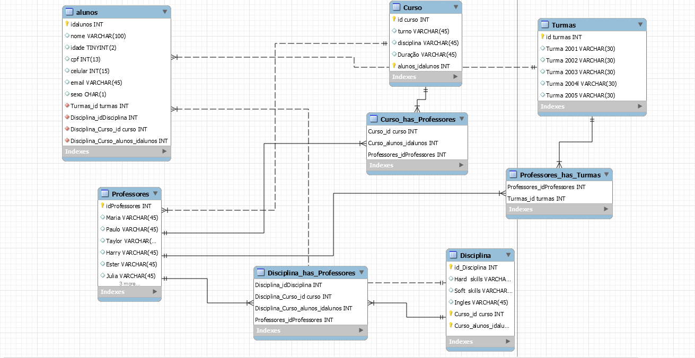

<h1>Banco De Dados Resilia Educação </h1>

  
 

<b>Desafio:</b>

 

> A Resilia está pensando em lançar um novo sistema de
acompanhamento e para isso precisa de ajuda para modelar um
banco de dados que vai armazenar seus cursos, turmas e alunos.

> Para isso, precisamos criar um banco de dados para armazenar informações como: os cursos, quantidade de turmas e dados dos alunos cadastrados no sistema Resilia de Educação.

> Com a criação de uma Query, responderemos as perguntas a seguir

 

<b>Perguntas</b>

 

> + Existem outras entidades além dessas três?
 
> + Quais são os principais campos e tipos?
 
> + Como essas entidades estão relacionadas?

  

<b>Respostas</b>

 

> + Sim, pois de
> + 
> + muitos para muitos

<b>Conhecimentos Adquiridos</b>

 

> Criação de Bancos De Dados
  
> Utilização da ferramenta mySQL
 /br>
> Consultas e Queries no banco de dados

 

<b>Ferramentas utilizadas</b>

 

> mySQL

