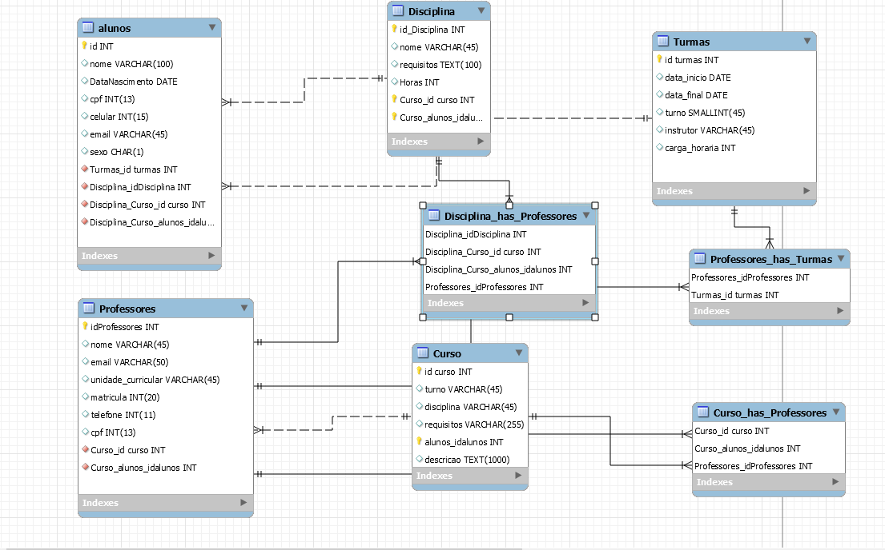

<h1>Banco de dados (MySQL)-Projeto Individual Módulo 4</h1>

  
 

<b>Desafio:</b>

 

> A Resilia está pensando em lançar um novo sistema de
acompanhamento e para isso precisa de ajuda para modelar um
banco de dados que vai armazenar seus cursos, turmas e alunos.
> Para apoiar nesse sistema recebemos a tarefa de realizar essa modelagem e responder algumas perguntas com nosso modelo

 

<b>Perguntas</b>

 

> + Existem outras entidades além dessas três?
  
> + Quais são os principais campos e tipos?
  
> + Como essas entidades estão relacionadas?

 

<b>Respostas</b>

 

> + Sim, as entidade são criadas de acordo com as necessidades.
  
> + Disciplinas ,alunos, professores, cursos e turmas.
  
> + Estão relacionados em ligação de (N:N) (1:N)

 

<b>Conhecimentos Adquiridos</b>

 

> Criação de Bancos De Dados
  
> Utilização da ferramenta mySQL
  
> Comandos para criação de tabelas, atributos, etc.

 

<b>Ferramentas utilizadas</b>

 

> MySQL Workbench

